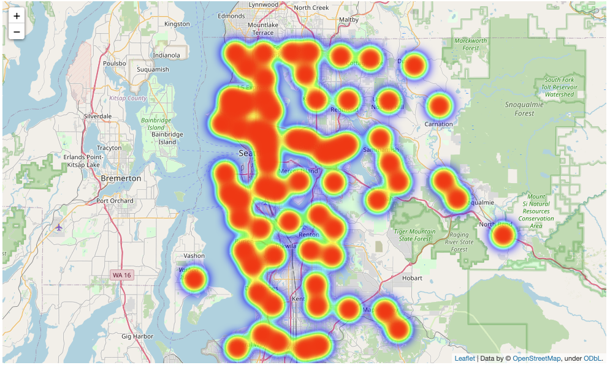
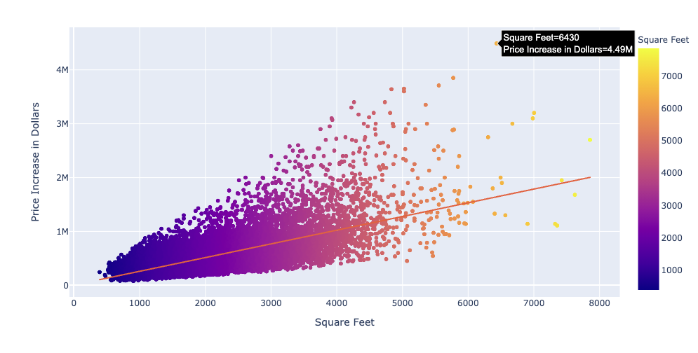
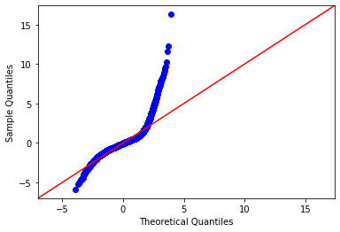
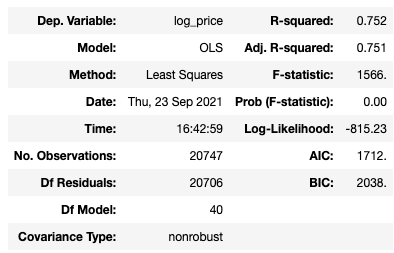
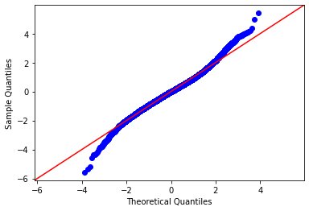
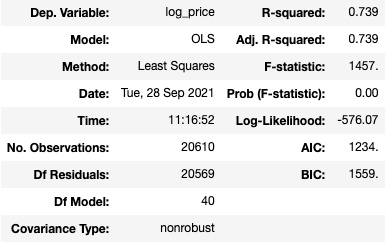
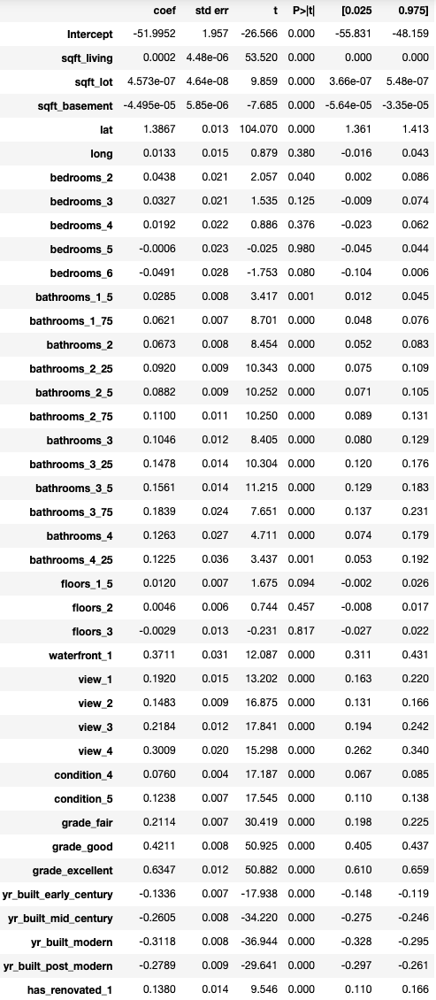
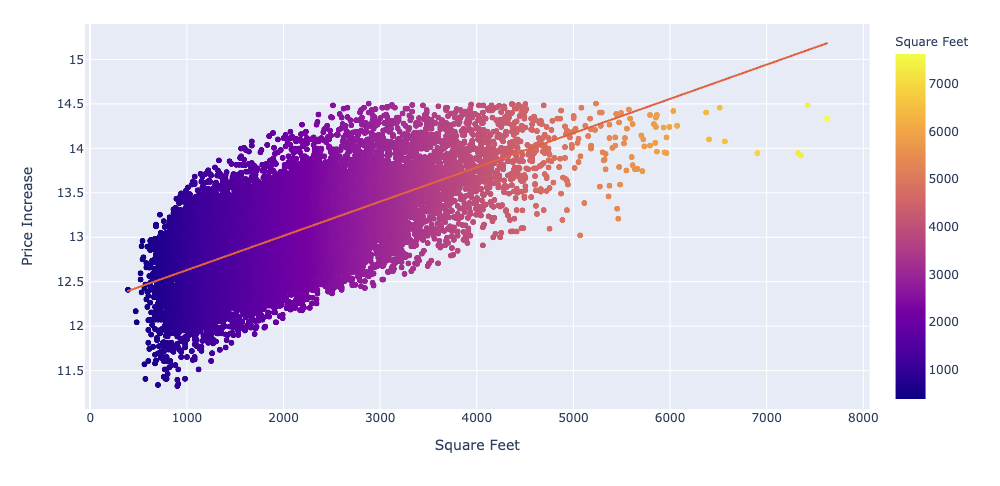
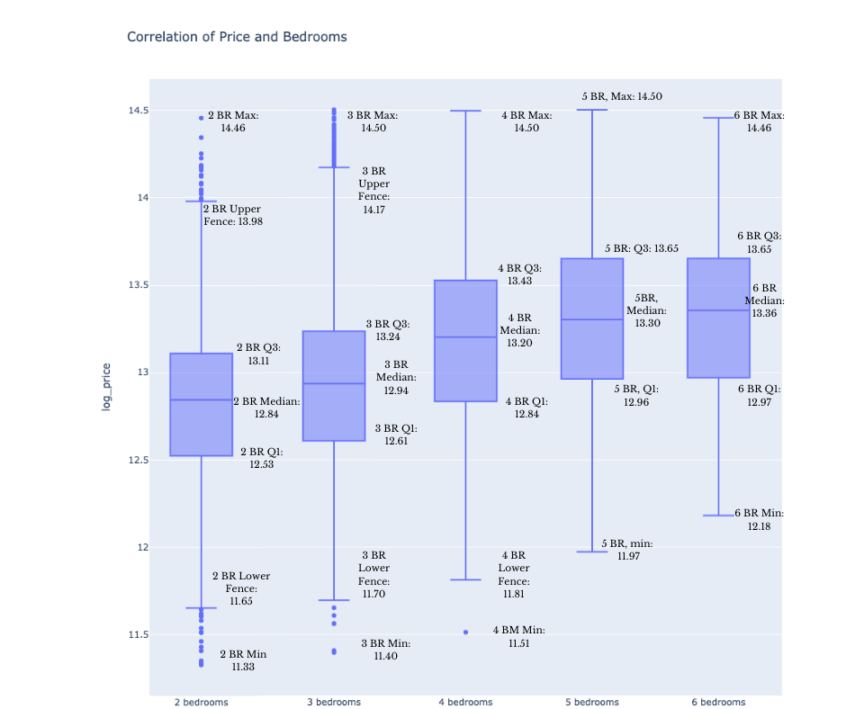

# King's County Housing Data Linear Regression Analysis 

The aim of this experiment in linear regression is to assess the fluctuation of prices of homes in Kings County, Seattle for a private equity firm focusing on real estate acquisitions. The manipulation of the homes' variables such as square feet, waterfronts, and other architectural features affect the over total worth of the home and it is the intention of these linear models to explain the value of the home. 

The data from collected for the experiment ranges from 2014 to 2015 and it is important to acknowledge the limitations of that specific factor as home prices were in a steep heel which marked the 2010's housing market from its recovery from the previous decade. 

# Business Problem

The project was financed by a private equity firm looking to invest in the private home sector across the King's County area.

This linear regression analysis explains the relationship between an investment's price and the features of the underlying assest. 

Tne data used to project this model was limited to homes under six bedrooms and under the price of two million dollars. After analysis of the data it was determined that these are the most popular household dimensions.

While this leads to a more powerful and accurate infering model, it does not shed enough light on homes which would be concidered the top tier of Seattle realeastate. 

# Data

The data used in this linear regression is housing data from Kings' County, Seattle, Washington. The data included the following columns; these are their names and descriptions:

* **id** - unique identified for a house
* **dateDate** - house was sold
* **pricePrice** -  is prediction target
* **bedroomsNumber** -  of Bedrooms/House
* **bathroomsNumber** -  of bathrooms/bedrooms
* **sqft_livingsquare** -  footage of the home
* **sqft_lotsquare** -  footage of the lot
* **floorsTotal** -  floors (levels) in house
* **waterfront** - House which has a view to a waterfront
* **view** - Has been viewed
* **condition** - How good the condition is ( Overall )
* **grade** - overall grade given to the housing unit, based on King County grading system
* **sqft_above** - square footage of house apart from basement
* **sqft_basement** - square footage of the basement
* **yr_built** - Built Year
* **yr_renovated** - Year when house was renovated
* **zipcode** - zip
* **lat** - Latitude coordinate
* **long** - Longitude coordinate
* **sqft_living15** - The square footage of interior housing living space for the nearest 15 neighbors
* **sqft_lot15** - The square footage of the land lots of the nearest 15 neighbors

Of the columns provided the following where use for all three models:

Continious Variables: sqft_living, sqft_lot,sqft_basement,lat,long
Categorical Variables: bedroom,bathroom,floor,waterfront,view,condition,grade,yr_built,renovated

The baseline model was carried out using raw data 

The subsequent model used a logarithmic transformation of the price of the homes to make statistical predictions more valid

The third and final model focused on homes with a price under two-million dollars and under six bedrooms honning in on the niche market targeted by the private equity firm

# Results

## Model 1

The baseline model included data from all of the homes sold across Kings County, Seattle. 

The following graphic depicts the early correlation between price and square feet

It is when we look at the linearity of the model that we appreciate the short comings of its predictive prower

## Model 2

The second model was carried out using data after a logarithmic or Log-Level Regression was made on the price value as it is the dependent variable or determining outcome we are after.  

The 'R-squared' value depicts the percentage of uncerntatiy that the data used reflects the outcomes of this model
The error below depicts the errors made while calculating the values from the same data set split into 80/20 percent between the "train" data and the "test" data

Train: 173545.4282194569\
Test: 184910.2649419146

This number reflects the possible error from the actual home price of the underlying asset 

The Price to variable realtionship did, however, conciderally increase

## Model 3

The third model was performed under the same cirmustances as the second model with the exception that home prices were kept under two-million dollars and the number of bedrooms per home was six or less.

**Train: 157,669.94\
Test: 153,145.46**

The final model depicts a complex relationship between price and the underlying features of the home. The most correlated asset was the of square foot per home with the a positive correlation between price and increase of area. 

This is a model where the dependent variable is logged but the independent variable is not:

ln(Y) = a + bX + e

This is known as a log-level model and the interpretation is that a unit increase in X results in a 100*b% increase in Y (we multiply by 100 because b is a percentage).

This would mean that a year increase in bedrooms is associated with a roughly 100*b% increase in price (log_price).

